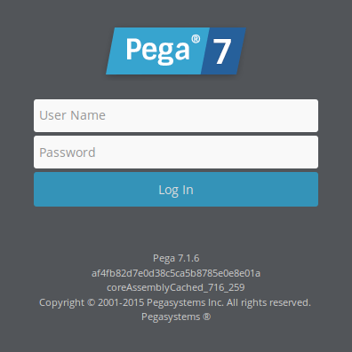
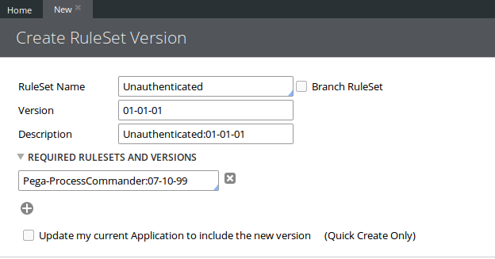
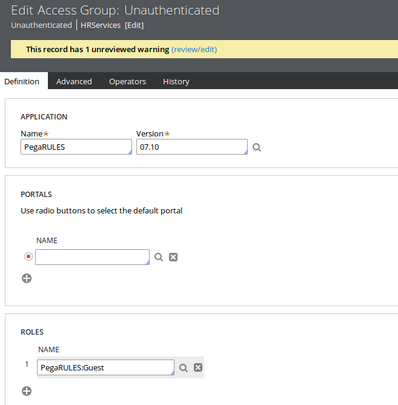
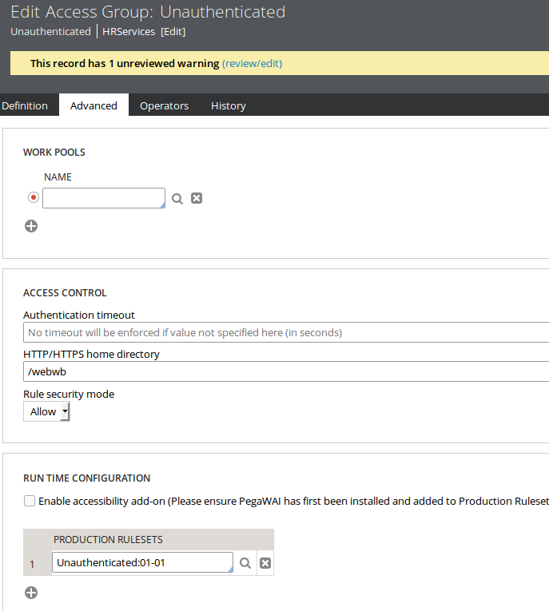
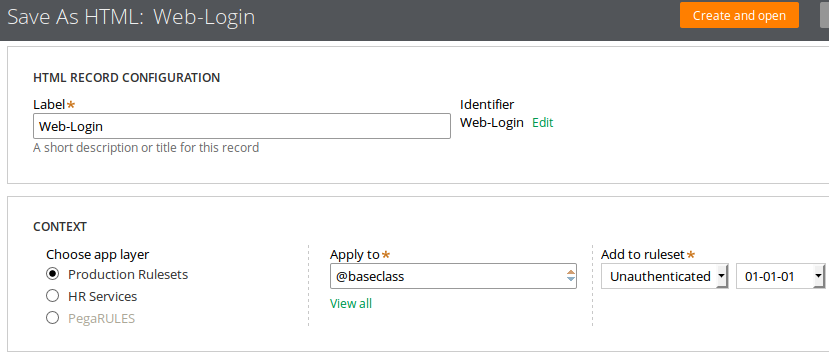
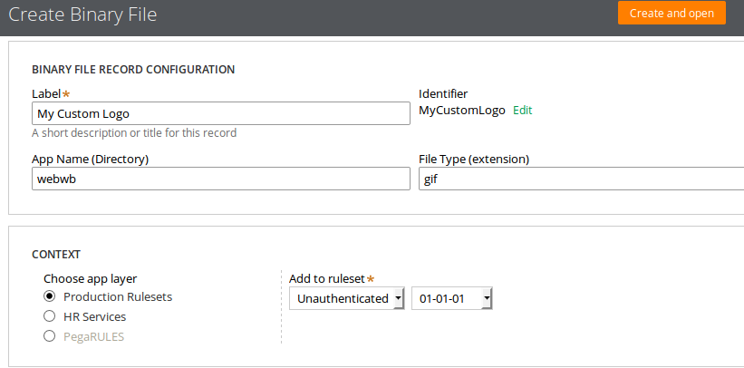
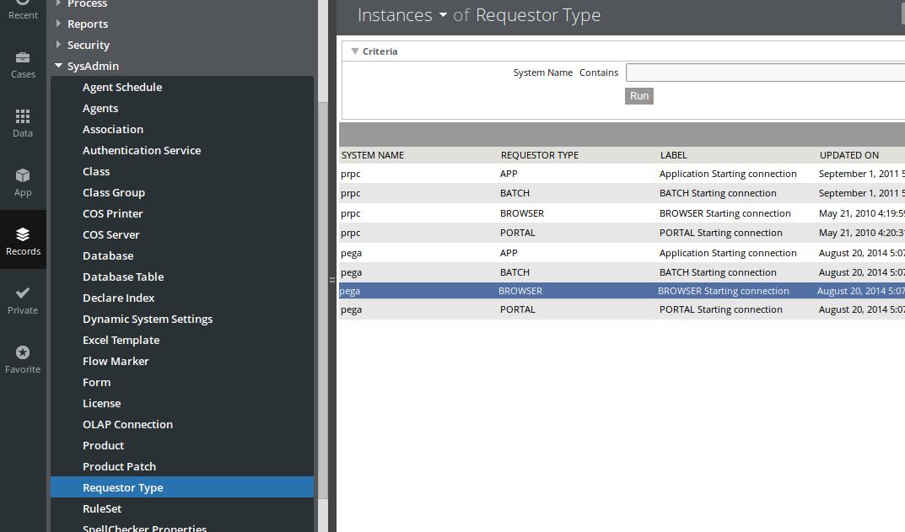
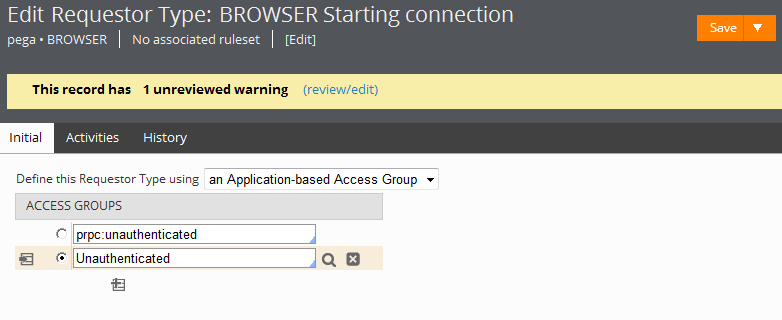
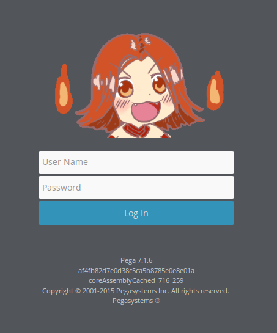

# 自定义Pega登录界面


> Pega版本：Pega 7.1.6

## 前言

Pega 7默认的登录界面是有Pega公司Logo的这个，而有些时候我们却需要自己定义Pega的登录界面。



默认的登录页面是显示给那些启动了PRPC但却还没有登录的访客的，系统默认分配PRPC:Unauthenticated这个access group给这些访客。

要自定义登录界面，我们需要创建一个access group和一个ruleset来保存登录界面，然后配置系统使用我们创建的ruleset和access group来代替系统默认分配给未登录访客的ruleset和access group。

## 实现方法

### 新建一个ruleset

创建一个ruleset和一个ruleset版本来存放自定义登录界面的rules。给这个ruleset起一个容易识别的名字，例如：Unauthenticated:01-01-01。



### 新建一个access group

给未未验证登录的访客创建一个access group





1. Application设置为PegaRULES，并设置相应的版本号
2. Roles设置为PegaRULES:Guest，即访客的access role
3. 把Unauthenticated:01-01作为Production Ruleset设置给这个新的ruleset并把它添加到你自己当前的access group上（这样你才能向这个新ruleset中保存rule）

> **注意**：当你保存这个access group时会出现一个警告说你创建的这个ruleset没有在application中定义，你可以忽略这个警告。

### 保存rule到新的ruleset中

保存下列标准rule的副本到Unauthenticated:01-01-01这个ruleset中（不要更改rule的名字）

| Rule         | 描述                                      |
| :------      |:------                                    |
| web-login    | 这个HTML rule定义了login页面的图片和其他元素 |



新建一个Binary File Rule到Unauthenticated并上传一张图片



在Web-Login中找到

``` HTML

```

并替换为

``` HTML

```

你也可以修改Web-Login中的其他内容来进一步自定义登录界面

### 更新Requestor Type

Requestor type数据实例定义了可以访问Pega 7的请求者类型，例如：一个浏览器会话，一个外部应用或是一个内部后台进程。当某人试图通过正常方式使用浏览器访问Pega 7的时候就是建立在BROWSER的Requestor Type之上的。

1. 在Records Explorer中选择SysAdmin > Requestor Type
2. 打开pega BROWSER

3. 添加"Unauthenticated"access group到Access Groups列表中，并选择前面的单选框

4. 保存这个Requestor Type

> **注意**：一定要确保"Unauthenticated"access group前的单选框是选中的状态，如果没有，选中它再保存一次。

登出后就可以看到效果了



当然，你也可以运行PegaSample.pzrunWebLogin这个Activity，这样就可以在登录的状态下实时预览修改后登录界面的效果了。

---

## 参考资料
* [PDN: Customizing the Pega 7 login screen] [customizing-the-pega-7-login-screen]

[customizing-the-pega-7-login-screen]: https://pdn.pega.com/user-interface/customizing-the-pega-7-login-screen "Customizing the Pega 7 login screen"
