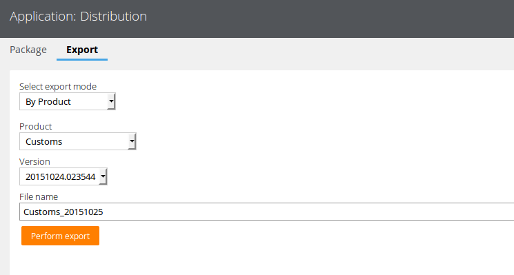

# Pega如何导出应用程序

> Pega版本：Pega 7.1.8

## 前言

当我们在Pega 7中完成一个应用程序后怎么把应用程序导出来并发给其他人呢？

<!--more-->

## 操作步骤

### 打开导出页面

点击左上角DesignerStudio图标，依次选择Application -> Distribution -> Package

### 配置导出参数

在Package标签配置好你要导出的Application，Ruleset Name和RuleSet version

一路点击Next，直到遇到如下画面

然后切换到Export标签在导出模式中选择Product

在产品列表中选择我们自己建的应用

在版本列表中选择最新的版本

给导出的文件起一个名字，例如我的命名规则：应用名 + "_" + 8位日期

### 锁定RuleSet

点击“执行导出”按钮后会出现如下提示：
> 这个Product涉及未锁定的RuleSet版本实例，请使用下面链接锁定它们或更新你的Product rule以允许导出未锁定的版本。如果在Product rule中勾选了允许导出未锁定版本的RuleSet，请确保你保存了该Product rule，否则不会生效。

依次点开提示中的链接后点击“Lock and Save”锁定RuleSet版本

### 设置Product rule

**注意**：如果你已经锁定了RuleSet（[锁定RuleSet](#锁定ruleset)）则无需此操作

打开左侧的Records面板，依次点开SysAdmin -> Product，找到我们要导出的Product对应的Product rule

在Product rule的底部勾选“Allow unlocked ruleset versions?”然后保存

### 导出应用

设置完成后就可以导出应用了

点击“执行导出”按钮，耐心等待，导出完成后会出现一个链接，右键另存为即可保存导出的应用到本地

---

## 附1：导出单条Rule

前面我们实现了整个应用的导出，但如果我们只想导出一条或几条Rule时该怎么办呢？

其实我们在[配置导出参数](#配置导出参数)的第一步，在Package标签中一路点击Next到最后时，Pega 7自动为我们生成了一条Product Rule。我们在[设置Product rule](#设置Product_rule)时仅仅是设置其允许导出未锁定版本的RuleSet，其实我们可以做的更多。

在我们想导出的Rule的右上角，点击Action按钮并选择View XML

然后搜索pzInsKey

然后我们新建一个Product的Rule，把pzInsKey里面的内容填到Individual instances to include区域的Key下，Label下的内容可以随便填

保存Product Rule后点击最下面的Create product file按钮即可导出单条Rule了

## 附2：更简单的导出方法

在Application Menu中选择Open Overview

点击左上角的Action按钮，依次选择 Package Application -> Basic 即可导出应用程序了

