# 在Pega中使用自定义字体


> Pega版本：Pega 7.1.8

## 前言

在 CSS3 之前，web 设计师必须使用已在用户计算机上安装好的字体。通过 CSS3，web 设计师可以使用他们喜欢的任意字体。当你找到或购买到希望使用的字体时，可将该字体文件存放到 web 服务器上，它会在需要时被自动下载到用户的计算机上。

> 更多关于WebFont的信息可以参考 [W3C的资料](http://www.w3school.com.cn/css3/css3_font.asp "CSS3 字体")

Pega 7正是利用这一点可以在页面上使用用户并没有安装的字体。

<!--more-->

## 实现方法

### 获取WebFont字体

你可以从网上下载自己喜欢的字体，然后通过 [Font Squirrel提供的在线工具](http://www.fontsquirrel.com/tools/webfont-generator "Webfont Generator") 生成WebFont

当然，你也可以直接从网上下载WebFont，国内比较好的平台是阿里巴巴旗下的 [阿里妈妈webfont平台](http://www.iconfont.cn/webfont)

> **注意：**Font Squirrel在线工具生成的CSS样式文件不能直接在Pega 7中使用，需要参照下面提供的例子做少许修改。

这里提供一个WebFont [cinzelregular](cinzel-regular-webfont.zip "cinzelregular") 作为例子

### 上传字体到Pega 7

通过Font Squirrel生成的WebFont共有5种格式以支持不同的浏览器（第一个是CSS样式文件）

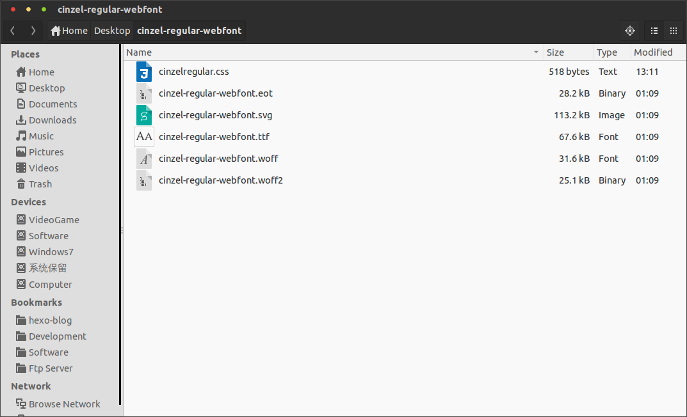

Pega 7中通过Binary File来存储字体文件

在Application Explorer中找到自己的Application，右键依次选择 +Create -> Technical -> Binary File 来创建一个Binary File

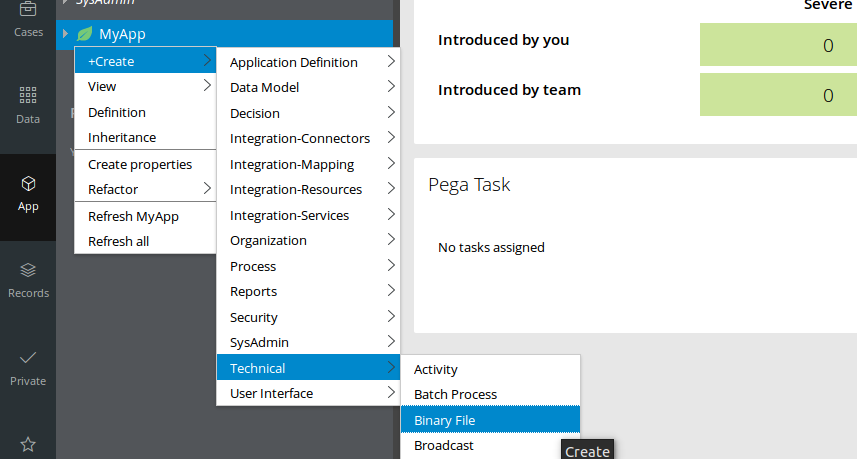

在Label中输入和字体文件一样的名字后，Identifier会自动生成，由于Pega 7默认会通过去掉Label中的特殊字符并大写首字母的方式来自动生成Identifier，所以要保证Identifier和字体文件的名字一样，就要按旁边的Edit链接来手动编辑Identifier。App Name (Directory)中一定要填写webwb，File Type (extension)中要分别填写5种字体的文件扩展名（eot，svg，ttf，woff和woff2）。所以我们要分别创建5个Binary File。

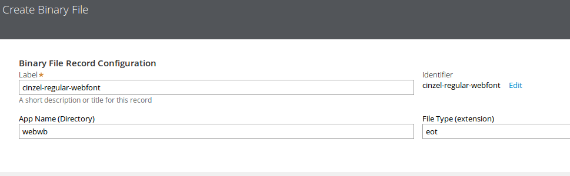

最后点击Upload File按钮并选择相应的字体文件上传后保存Rule即可。

App Name (Directory)中一定要填写webwb的原因是，webwb是默认的HTTP/HTTPS home directory，在Access Group的Advanced标签中可以找到

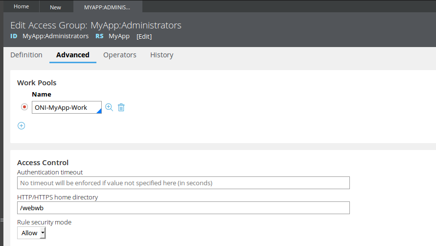

### 上传CSS样式文件

在创建好5个字体文件的Binary File后还要键一个Text File来存放调用字体文件的CSS样式文件

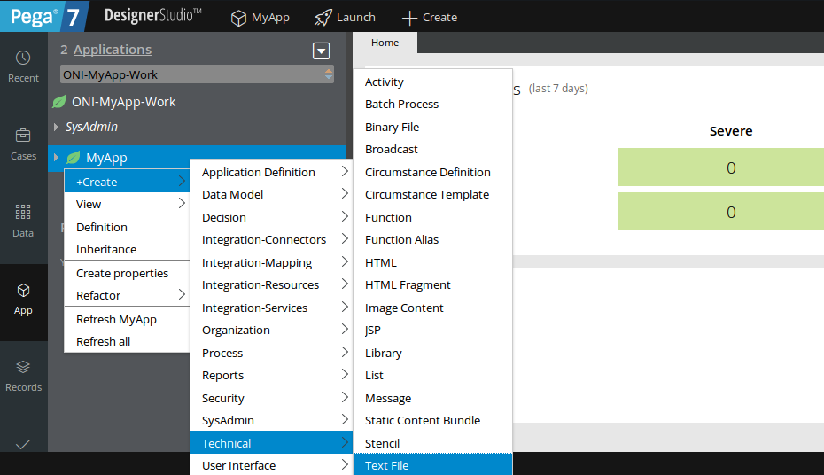

Label和Identifier填cinzelregular，App Name (Directory)填webwb，File Type (extension)填css

创建Text File后上传CSS样式文件到Text File中再保存即可

<a name="font-name"></a>

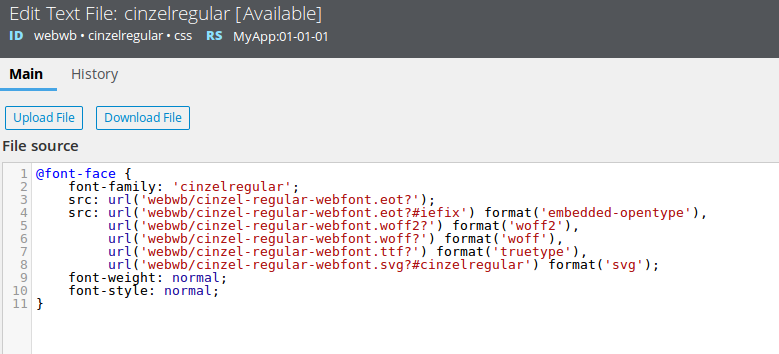

其中

```CSS
font-family: 'cinzelregular';
```

指明了该字体的名字是cinzelregular

### 配置Application Skin

打开Application Skin

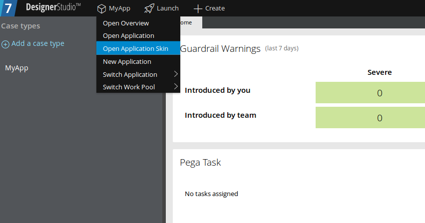

在Included styles标签的Additional style sheets域下点击Add style sheet链接，把我们刚刚创建的CSS样式文件添加进去

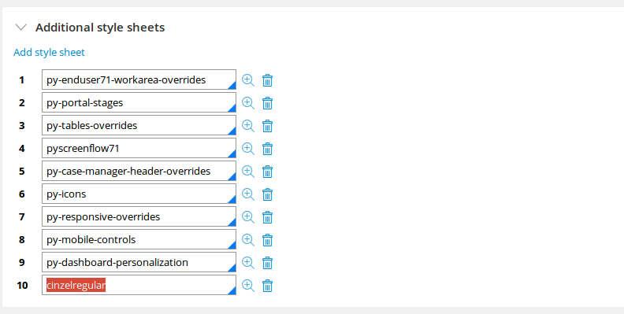

再切换到Mixins标签，在Overall font中选择Other，然后填写上我们上传的字体的名字（[在CSS样式文件中指定的](#font-name)）

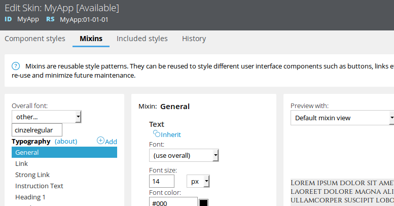

保存Skin Rule后新建一个Case就能看到效果了

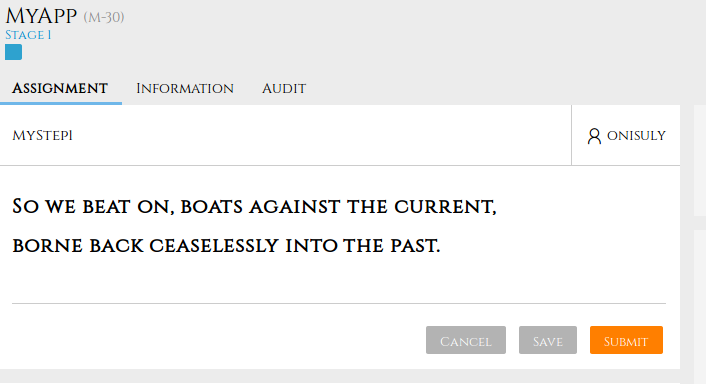

## 参考资料
* [PDN: Using custom webfonts in your Pega 7 application] [using-custom-webfonts-in-your-pega-7-application]

[using-custom-webfonts-in-your-pega-7-application]: https://pdn.pega.com/pegatube/using-custom-webfonts-in-your-pega-7-application "Using custom webfonts in your Pega 7 application"

---

## 附：字体图标

使用Webfont并不是仅仅能改变界面的字体这么简单，你还可以把WebFont当做图标来使用。

这里以 [FontAwesome](FontAwesome.zip) 为例

用法和更改字体时基本一致，只不过不需要在Application Skin的Mixins标签中设置Overall font了，毕竟我们不是要更改页面的字体。

在Section上拖拽一个Icon/Image Control，然后将Icon source设置为Icon Class，Class中填写相应的类即可，这里以fa fa-firefox fa-3x为例（具体用法可以参考 [Font Awesome官网](http://fontawesome.io/ "Font Awesome官网")）

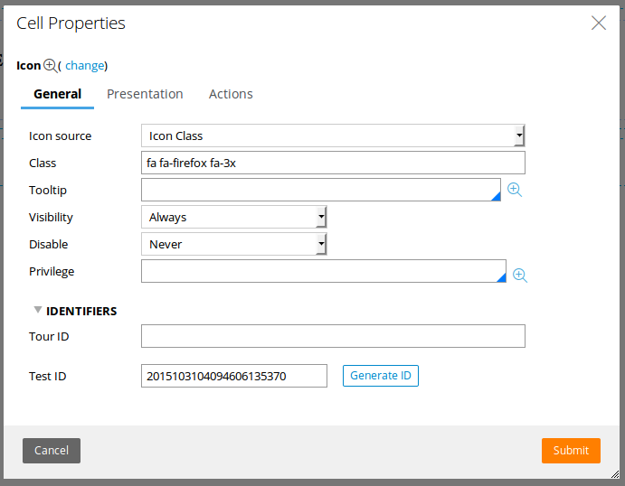

看下最后的效果吧

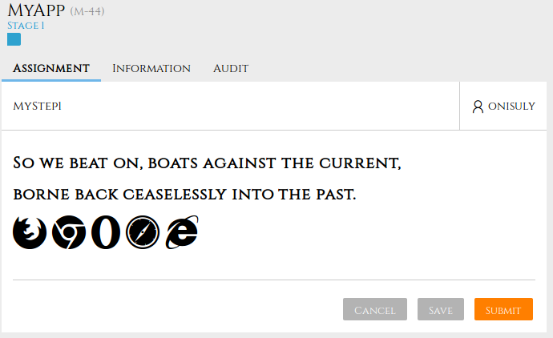