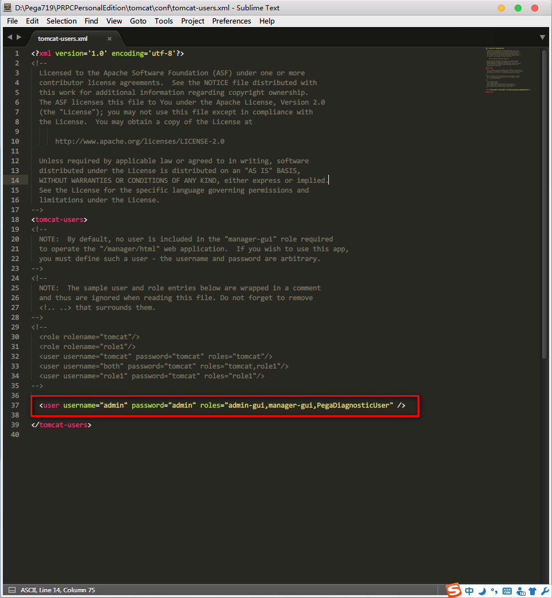

# Pega PE版安装后的常用配置

> Pega版本：Pega 7.1.9

## 前言
在Pega 7的PE版安装好后我们有一些常用的功能要配置一下。

<!--more-->

## 常用配置

### 编辑PRPC Shutdown脚本

右键编辑Shutdown快捷方式

将这里的smart改为fast，这样关闭PRPC时能更快些。

以下是PostgreSQL官网的参数解释：

> In stop mode, the server that is running in the specified data directory is shut down. Three different shutdown methods can be selected with the -m option. "Smart" mode (the default) waits for all active clients to disconnect and any online backup to finish. If the server is in hot standby, recovery and streaming replication will be terminated once all clients have disconnected. "Fast" mode does not wait for clients to disconnect and will terminate an online backup in progress. All active transactions are rolled back and clients are forcibly disconnected, then the server is shut down. "Immediate" mode will abort all server processes immediately, without a clean shutdown. This will lead to a crash-recovery run on the next restart.

### 开启PostgreSQL数据库远程访问

在 PRPCPersonalEdition\pgsql\data 目录下找到pg_hba.conf和postgresql.conf这两个文件

编辑pg_hba.conf文件，添加如下配置，来允许所有IP远程访问

编辑文件postgresql.conf，添加如下配置，来允许数据库服务器监听来自任何主机的连接请求

### 给Tomcat添加User

在Tomcat的tomcat-users.xml文件中添加如下一行。admin-gui和manager-gui角色是为了登录Tomcat使用。PegaDiagnosticUser是Pega定义的角色，你可以在prweb的web.xml中找到其定义。有了PegaDiagnosticUser这个角色就可以下载Pega中的日志了。

## 参考资料
* [PostgreSQL: Documentation: 9.1: pg_ctl] [postgresql-documentation-pg_ctl]
* [PostgreSQL: Documentation: 9.1: The pg_hba.conf File] [postgresql-documentation-pg_hba]
* [PostgreSQL: Documentation: 9.1: Connections and Authentication] [postgresql-documentation-postgresql]

[postgresql-documentation-pg_ctl]: https://www.postgresql.org/docs/9.1/static/app-pg-ctl.html "PostgreSQL: Documentation: 9.1: pg_ctl"
[postgresql-documentation-pg_hba]: https://www.postgresql.org/docs/9.1/static/auth-pg-hba-conf.html "PostgreSQL: Documentation: 9.1: The pg_hba.conf File"
[postgresql-documentation-postgresql]: https://www.postgresql.org/docs/9.1/static/runtime-config-connection.html "PostgreSQL: Documentation: 9.1: Connections and Authentication"
